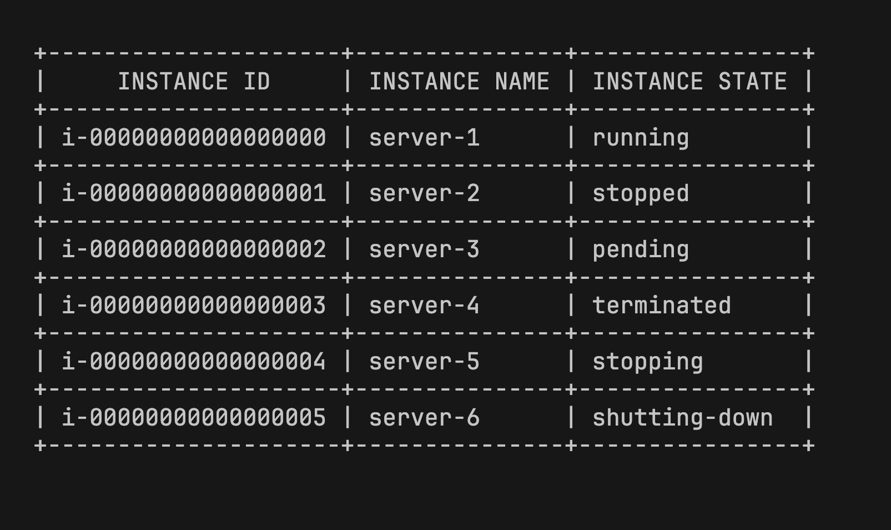
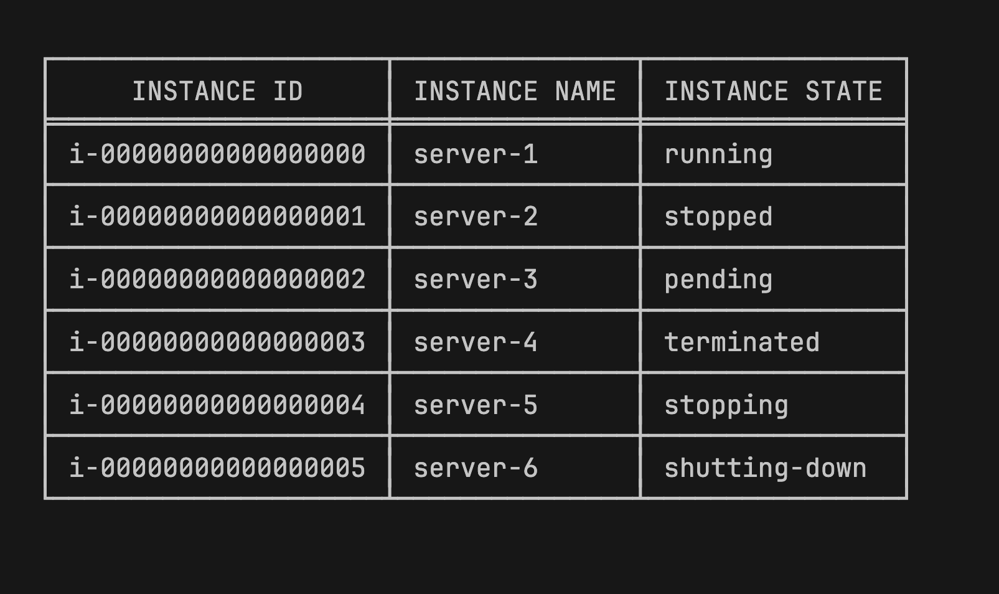
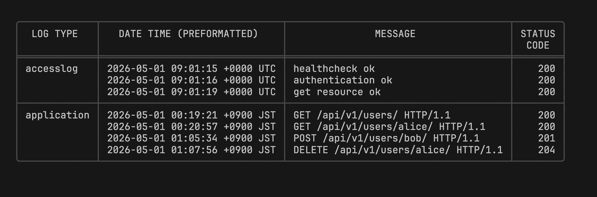
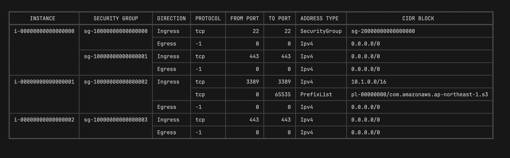
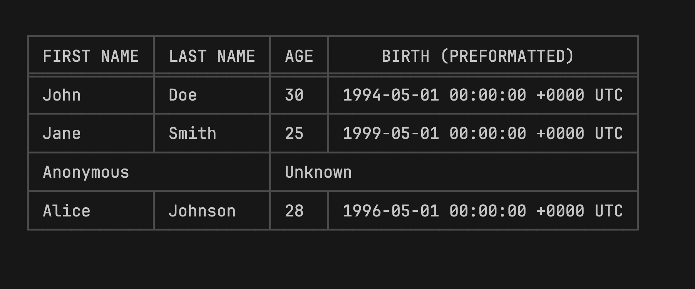
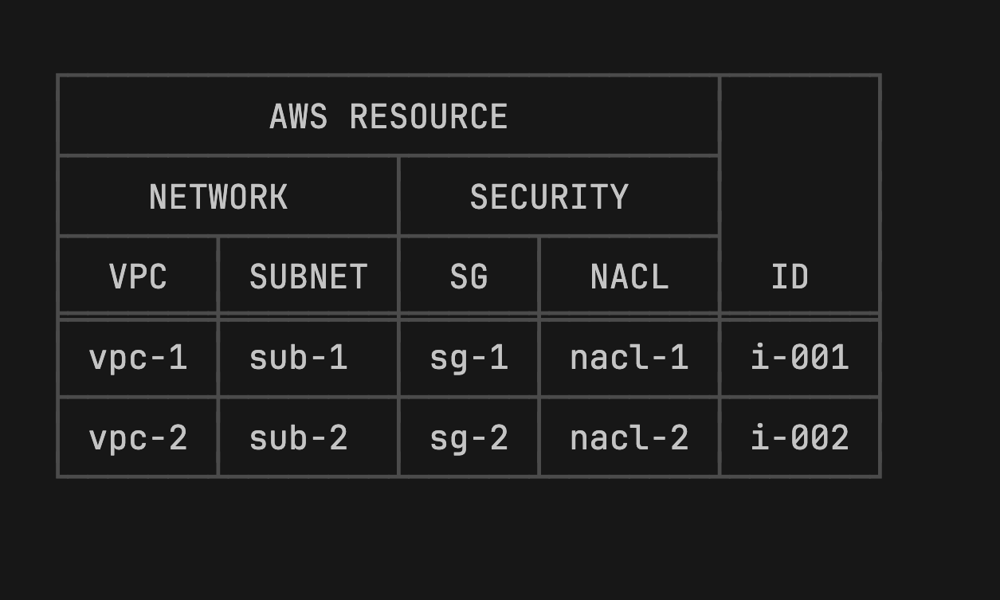
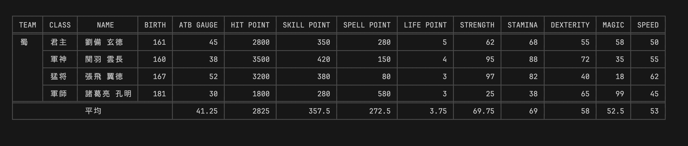
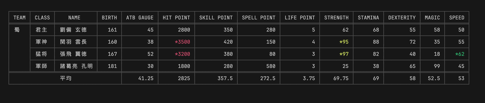
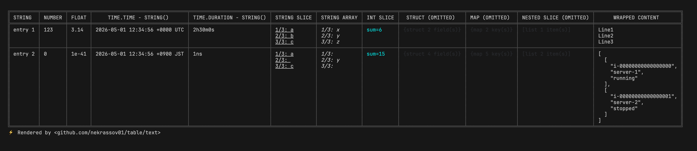

<p align="center">
  
</p>
<h1 align="center">TABLE</h1>

<p align="center">A high-performance table rendering library for Go, with streaming APIs for every output format.</p>
<p align="center">
  <a href="https://github.com/nekrassov01/table/actions/workflows/ci.yml"></a>
  <a href="https://pkg.go.dev/github.com/nekrassov01/table"></a>
  
</p>

## Table of contents

- [Table of contents](#table-of-contents)
- [Overview](#overview)
- [Motivation](#motivation)
- [Output formats](#output-formats)
- [Text output gallery](#text-output-gallery)
- [Installation](#installation)
- [Examples](#examples)
  - [Table](#table)
  - [Stream](#stream)
- [Table library comparison](#table-library-comparison)
  - [Formats](#formats)
  - [Features](#features)
- [Performance](#performance)
- [Documentation](#documentation)
- [Author](#author)
- [License](#license)

## Overview

`nekrassov01/table` renders Go data as terminal tables, markup tables, or CSV records. Each output package provides `Table` for complete data sets and `Stream` for row-at-a-time output while retaining the selected format's own structure and escaping rules.

- Use functional options for clear, reusable configuration.
- Minimize memory allocations for efficient rendering.
- Adapt typed slices and error-returning iterators with `TableOf` and `StreamOf`.
- Measure Unicode text by terminal display width, including ambiguous character widths in CJK locales.
- Add headers, calculated footers, indexes, placeholders, transformations, alignment, decoration, and cell spans through format-specific options.

## Motivation

The project was created for four reasons:

- To provide a table renderer that is fast, efficient, and easy to use.
- To provide row-at-a-time output across every format, which no comparable library offered at the time.
- To manage table-oriented output formats for applications such as CLIs in one module.
- To support the less common Backlog table notation, which only the author's earlier [`mintab`](https://github.com/nekrassov01/mintab) project covered at the time.

## Output formats

Choose an output package for the destination. The root [`table`](.) package provides shared interfaces, typed row adapters, and errors; it does not select an output format.

| Package                  | Output                                                                                                                                                                                                                 | Use it for                     |
| ------------------------ | ---------------------------------------------------------------------------------------------------------------------------------------------------------------------------------------------------------------------- | ------------------------------ |
| [`text`](./text)         | Unicode or ASCII bordered tables                                                                                                                                                                                       | CLIs, terminals, and logs      |
| [`html`](./html)         | Semantic HTML tables                                                                                                                                                                                                   | Web pages and reports          |
| [`markdown`](./markdown) | GFM tables                                                                                                                                                                                                             | READMEs and GitHub             |
| [`backlog`](./backlog)   | [Backlog table notation](https://help-center.backlog.com/%E3%83%86%E3%82%AD%E3%82%B9%E3%83%88%E6%95%B4%E5%BD%A2%E3%83%AB%E3%83%BC%E3%83%AB%EF%BC%88Backlog%E8%A8%98%E6%B3%95%EF%BC%89-6a1d4d7f3abb3ada78c5658b#index7) | Backlog issues and Wiki pages  |
| [`csv`](./csv)           | Configurable delimiter-separated records                                                                                                                                                                               | TSV, CSV, and data interchange |

## Text output gallery

The examples below show the `text` package in several configurations.

ASCII



Simple



Compact layout with horizontal lines omitted and a colored light border style



Row spans with a colored rounded border style



Column spans with a colored heavy border style



Stacked header with a colored light border style



Calculated footer with CJK text and a colored light border style



Calculated footer with CJK text, value transformations, and a colored light border style



Complex values with a colored light border style



## Installation

Install with:

```sh
go get github.com/nekrassov01/table
```

## Examples

The following examples render typed application data with `Table` and `Stream`. The runnable examples accept an output package, an optional mode, and an optional data set. This command renders every text Table example:

```sh
go run ./examples/cmd text table
```

### Table

Use `TableOf` to keep application data typed until the row boundary. This example renders deployment status to a terminal.

```go
package main

import (
    "log"
    "os"

    "github.com/nekrassov01/table"
    "github.com/nekrassov01/table/text"
)

type Deployment struct {
    Service string
    Desired int
    Ready   int
    Status  string
}

func deploymentRow(deployment Deployment) []any {
    return []any{
        deployment.Service,
        deployment.Desired,
        deployment.Ready,
        deployment.Status,
    }
}

func main() {
    deployments := []Deployment{
        {Service: "payments", Desired: 4, Ready: 4, Status: "healthy"},
        {Service: "search", Desired: 3, Ready: 2, Status: "degraded"},
        {Service: "worker", Desired: 8, Ready: 8, Status: "healthy"},
    }

    output := text.NewTable(os.Stdout,
        text.WithHeader([]string{"SERVICE", "DESIRED", "READY", "STATUS"}),
        text.WithAlign(text.ScopeBody, text.Columns(1, 2), text.AlignRight),
        text.WithCompact(),
    )
    if err := output.Render(table.TableOf(deployments, deploymentRow)); err != nil {
        log.Fatal(err)
    }
}
```

This program produces the following table:

```text
┌──────────┬─────────┬───────┬──────────┐
│ SERVICE  │ DESIRED │ READY │  STATUS  │
╞══════════╪═════════╪═══════╪══════════╡
│ payments │       4 │     4 │ healthy  │
│ search   │       3 │     2 │ degraded │
│ worker   │       8 │     8 │ healthy  │
└──────────┴─────────┴───────┴──────────┘
```

### Stream

Use `StreamOf` to adapt an `iter.Seq2[T, error]` to streaming table rows. Each successful value becomes one output row, and the first source error is forwarded. Additionally, call `Stream.Close` for every stream so it can write deferred output, such as a footer or closing border, and report late errors.

```go
package report

import (
    "errors"
    "io"
    "iter"
    "time"

    "github.com/nekrassov01/table"
    "github.com/nekrassov01/table/text"
)

type AuditEvent struct {
    Time     time.Time
    Actor    string
    Action   string
    Resource string
}

func WriteAuditEvents(
    w io.Writer,
    events iter.Seq2[AuditEvent, error],
) (err error) {
    output := text.NewStream(w,
        text.WithHeader([]string{"TIME", "ACTOR", "ACTION", "RESOURCE"}),
        text.WithCompact(),
    )
    defer func() {
        err = errors.Join(err, output.Close())
    }()

    rows := table.StreamOf(events, func(event AuditEvent) []any {
        return []any{
            event.Time.Format(time.RFC3339),
            event.Actor,
            event.Action,
            event.Resource,
        }
    })
    for row, sourceErr := range rows {
        if sourceErr != nil {
            return sourceErr
        }
        if renderErr := output.Render(row); renderErr != nil {
            return renderErr
        }
    }
    return nil
}
```

Given an iterator of audit events, the function produces output like this:

```text
┌───────────────────────────┬────────────┬───────────┬──────────────┐
│           TIME            │   ACTOR    │  ACTION   │   RESOURCE   │
╞═══════════════════════════╪════════════╪═══════════╪══════════════╡
│ 2026-08-21T09:00:00+09:00 │ deploy-bot │ reconcile │ payments-api │
│ 2026-08-21T09:03:00+09:00 │ alice      │ scale     │ worker       │
│ 2026-08-21T09:08:00+09:00 │ bob        │ rollback  │ search-api   │
└───────────────────────────┴────────────┴───────────┴──────────────┘
```

## Table library comparison

The following tables compare the public APIs in the versions pinned by the [benchmark module](./benchmarks/go.mod).

### Formats

This table records the output implementations documented by each library. `✓` means the library provides a dedicated output mode for the format, and `-` means it does not. `table` targets the GFM table extension; the other Markdown entries indicate generic Markdown table output.

| Output format    | `table` | [`mintab` v0.1.4](https://github.com/nekrassov01/mintab/tree/v0.1.4) | [`go-pretty` v6.7.10](https://github.com/jedib0t/go-pretty/tree/v6.7.10) | [`tablewriter` v1.1.4](https://github.com/olekukonko/tablewriter/tree/v1.1.4) |
| ---------------- | ------- | -------------------------------------------------------------------- | ------------------------------------------------------------------------ | ----------------------------------------------------------------------------- |
| Text             | ✓       | ✓                                                                    | ✓                                                                        | ✓                                                                             |
| HTML             | ✓       | -                                                                    | ✓                                                                        | ✓                                                                             |
| Markdown         | ✓       | ✓                                                                    | ✓                                                                        | ✓                                                                             |
| Backlog notation | ✓       | ✓                                                                    | -                                                                        | -                                                                             |
| CSV or TSV       | ✓       | -                                                                    | ✓                                                                        | -                                                                             |
| SVG              | -       | -                                                                    | -                                                                        | ✓                                                                             |

### Features

This table records whether each library exposes a direct public API for a capability in at least one output implementation. It does not imply that every format can express the capability.

| Feature                         | `table`         | [`mintab` v0.1.4](https://github.com/nekrassov01/mintab/tree/v0.1.4) | [`go-pretty` v6.7.10](https://github.com/jedib0t/go-pretty/tree/v6.7.10) | [`tablewriter` v1.1.4](https://github.com/olekukonko/tablewriter/tree/v1.1.4) |
| ------------------------------- | --------------- | -------------------------------------------------------------------- | ------------------------------------------------------------------------ | ----------------------------------------------------------------------------- |
| Streaming API                   | ✓ (all formats) | -                                                                    | -                                                                        | ✓                                                                             |
| Header                          | ✓               | ✓                                                                    | ✓                                                                        | ✓                                                                             |
| Footer                          | ✓ (callback)    | -                                                                    | ✓                                                                        | ✓                                                                             |
| Vertical merge                  | ✓               | ✓                                                                    | ✓                                                                        | ✓                                                                             |
| Horizontal merge                | ✓               | -                                                                    | ✓                                                                        | ✓                                                                             |
| Reflection-based struct input   | -               | ✓                                                                    | -                                                                        | ✓                                                                             |
| CSV input                       | -               | -                                                                    | -                                                                        | ✓                                                                             |
| Per-column transformation       | ✓               | -                                                                    | ✓                                                                        | ✓                                                                             |
| Built-in sorting and filtering  | -               | -                                                                    | ✓                                                                        | -                                                                             |
| Pagination                      | -               | -                                                                    | ✓                                                                        | -                                                                             |
| Column hiding                   | -               | ✓                                                                    | ✓                                                                        | ✓                                                                             |
| Width, wrapping, and truncation | ✓               | -                                                                    | ✓                                                                        | ✓                                                                             |
| Automatic terminal fit          | ✓               | -                                                                    | -                                                                        | -                                                                             |
| Title or caption                | ✓               | -                                                                    | ✓                                                                        | ✓                                                                             |
| Pluggable output implementation | -               | -                                                                    | -                                                                        | ✓                                                                             |

For `table`, the feature matrix has the following qualifications:

- Footer callbacks allow values such as totals and averages to be calculated after the body has been processed.
- Column hiding is intentionally left to input adaptation, so `TableOf` and `StreamOf` can omit fields before rows reach the output package.
- Merge behavior depends on the selected output format and is documented in the [Public API guide](./docs/API.md).

## Performance

The comparison benchmark constructs each table, processes the scenario data, and writes the result to a reused buffer. Its options align content and table structure while preserving each library's native border style; the output is not byte-identical.

The figures are the best of five 10,000-iteration runs on an Apple M2 with Go 1.26.6. Each cell reports `allocs/op` followed by `ns/op`.

| Scenario        | `table`       | `mintab`    | `go-pretty`  | `tablewriter`   |
| --------------- | ------------- | ----------- | ------------ | --------------- |
| Simple          | **1 · 1,728** | 43 · 2,320  | 139 · 12,624 | 975 · 81,268    |
| Footer          | **1 · 7,821** | -           | 422 · 41,002 | 2,850 · 198,531 |
| Compact         | **1 · 2,549** | 62 · 3,891  | 188 · 20,996 | 1,292 · 100,454 |
| Repeated values | **1 · 4,883** | 110 · 7,792 | 362 · 38,253 | 2,480 · 160,701 |
| Complex values  | **5 · 6,758** | -           | 375 · 59,609 | 4,751 · 287,064 |

`table` was the fastest implementation in every comparable scenario, running 1.3 to 8.8 times as fast as the next-fastest alternative. A dash indicates an unsupported scenario.

Run the same comparison on your machine with:

```sh
make bench target=comparison
```

## Documentation

Use these references to select the API, understand its design, and work on the module itself.

| Resource                                                        | Contents                                                        |
| --------------------------------------------------------------- | --------------------------------------------------------------- |
| [Go Reference](https://pkg.go.dev/github.com/nekrassov01/table) | Exact declarations and symbol documentation                     |
| [Public API guide](./docs/API.md)                               | Options, output behavior, defaults, and format capabilities     |
| [Architecture](./docs/ARCHITECTURE.md)                          | Package structure, data flow, and state ownership               |
| [Design specification](./docs/DESIGN.md)                        | Design decisions, invariants, tradeoffs, and non-goals          |
| [Development guide](./docs/DEVELOPMENT.md)                      | Test, benchmark, coverage, and analysis commands                |
| [Performance baseline](./docs/BASELINE.md)                      | Benchmark procedure and performance acceptance criteria         |
| [Runnable examples](./examples)                                 | Shared data sets, options, and commands for every output format |

## Author

[nekrassov01](https://github.com/nekrassov01)

## License

[MIT](https://github.com/nekrassov01/table/blob/main/LICENSE)
