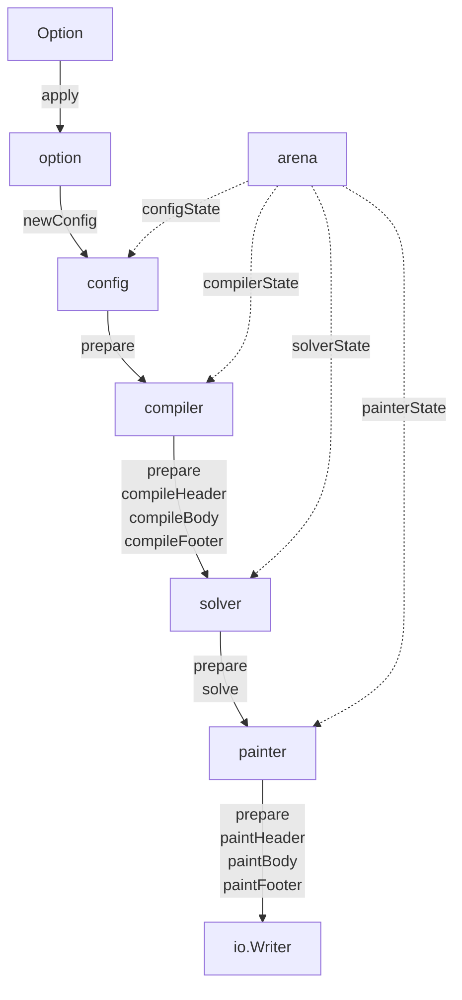

# Architecture

This document describes the architecture for maintainers.

## Table of contents

- [Architecture](#architecture)
  - [Table of contents](#table-of-contents)
  - [Repository layout](#repository-layout)
  - [Package layout](#package-layout)
  - [Data flow overview](#data-flow-overview)
  - [Data flow details](#data-flow-details)
    - [Option](#option)
    - [Config](#config)
    - [Compiler](#compiler)
    - [Solver](#solver)
    - [Painter](#painter)
  - [Pipelines](#pipelines)
    - [Table](#table)
    - [Stream](#stream)
  - [Reusability](#reusability)
    - [Acquisition and return](#acquisition-and-return)
    - [Reset between passes](#reset-between-passes)
    - [Release](#release)
  - [Internal packages](#internal-packages)
  - [Errors](#errors)

## Repository layout

The repository contains the following directories.

| Directory    | Category          | Role                                                  |
| ------------ | ----------------- | ----------------------------------------------------- |
| `.`          | Shared contract   | Common interfaces, row adapters, and errors           |
| `text`       | Output format     | Unicode or ASCII bordered text tables                 |
| `html`       | Output format     | Semantic HTML tables                                  |
| `markdown`   | Output format     | GitHub Flavored Markdown tables                       |
| `backlog`    | Output format     | Backlog notation tables                               |
| `csv`        | Output format     | Records separated by a configurable delimiter         |
| `internal/*` | Internal packages | Shared processing and repository maintenance commands |
| `examples`   | Samples           | Input data used by examples and benchmarks            |
| `benchmarks` | Benchmarks        | Performance measurements in an independent Go module  |

The five output packages do not depend on one another. Shared packages do not refer to the types or control flow of a specific output format.

## Package layout

Each output package generally contains the following files. Their responsibilities are nearly orthogonal, and corresponding responsibilities use the same filenames across formats.

| File          | Responsibility                                                                  |
| ------------- | ------------------------------------------------------------------------------- |
| `doc.go`      | Explain the package's intended use and important constraints.                   |
| `option.go`   | Define exported options and column selectors.                                   |
| `error.go`    | Add details to shared sentinels and construct a format-qualified `table.Error`. |
| `config.go`   | Determine logical columns from options, headers, footers, and body dimensions.  |
| `compiler.go` | Convert input values into format-specific logical rows and cells.               |
| `solver.go`   | Resolve display widths or span geometry.                                        |
| `painter.go`  | Assemble logical results into bytes and write them to an `io.Writer`.           |
| `arena.go`    | Own reusable stage state and manage acquisition and return of an `arena`.       |
| `table.go`    | Provide the `Table` API and control its pipeline.                               |
| `stream.go`   | Provide the `Stream` API, continuation state, and pipeline control.             |

## Data flow overview

Every output package accepts user settings through `Option` and processes them through the following stages.

| Format     | Pipeline                                                    |
| ---------- | ----------------------------------------------------------- |
| `text`     | `Option` -> `config` -> `compiler` -> `solver` -> `painter` |
| `html`     | `Option` -> `config` -> `compiler` -> `solver` -> `painter` |
| `markdown` | `Option` -> `config` -> `compiler` -> `solver` -> `painter` |
| `backlog`  | `Option` -> `config` -> `compiler` -> `solver` -> `painter` |
| `csv`      | `Option` -> `config` -> `compiler` -> `painter`             |

For the four formats with a `solver`, data flows as shown below. Solid arrows represent processing and result transfer. Dotted arrows show the `arena` providing state to each stage.

## Data flow details

### Option

`apply` sets defaults and then applies each `Option` in the order supplied, producing an `option` that later stages treat as read-only. Headers are part of `option`. Formats with footers also retain a function that produces footer rows.

### Config

`newConfig` builds `config` from a reference to `option`, its headers, and the number of body rows. In `text`, `html`, `backlog`, and `csv`, it also receives footer rows returned by the footer function and the body column count. It does not retain body values.

`prepare` combines this data with `configState` to determine logical columns. Markdown requires one header row and therefore uses its header width. Other formats use the widest non-empty header row when a header has at least one column. Without a header, they use the greater of the body column count and the widest footer row. The stage then adds an index column when enabled and applies `AllColumns` and `Columns` settings only to the resolved input columns. A selected index cannot expand the column count. The stage also detects configuration errors such as Markdown's `ErrHeaderRequired` and CSV's `ErrDelimiter`.

`configResult` retains the `option` reference, headers, body row count, and resolved column settings. In `text`, `html`, `backlog`, and `csv`, it also retains the current pass's footer and `footerColumns`. `compiler` uses that count to ensure the footer does not exceed the resolved column count.

### Compiler

`prepare` uses `configResult` and `compilerState` to reserve the required row and cell storage. In `text`, `html`, `markdown`, and `backlog`, it initializes per-column span settings. It also prepares scratch storage for escaping in `html`, `markdown`, and `backlog`, or quoting in `csv`. HTML escapes its caption at this stage.

`compileHeader` and `compileBody` convert headers and body values into logical rows and cells. `compileFooter` does the same for footers in `text`, `html`, `backlog`, and `csv`. Headers and footers use their configured labels. Formats other than CSV also select the attributes, colors, or decorations for the corresponding section. `compileBody` iterates the complete body, while `Stream` calls `compileRow` for one body row. Each row performs the following work as needed:

- Generate an index value and fill missing values with the placeholder.
- Call the transformer when configured, then use the input value's default string representation only when the transformer returns an empty string.
- Select the body attributes, colors, or decorations.

Formats with spans compare these resolved strings and record where equal values continue. Escaped strings and markup are not used for comparison. Each value is then escaped or quoted according to its format, and the selected attributes, colors, and decorations are retained in the cell. Formats that need byte sizes or display widths for later capacity or geometry calculations record them here. A body row or footer wider than the resolved column count produces `ErrColumnCount` at this stage.

`compilerResult` retains `configResult` and the compiled header and body. In `text`, `html`, `backlog`, and `csv`, it also retains the footer. Cell strings and span continuation positions or candidates are resolved at this point. Column widths and the `rowspan` and `colspan` counts written by HTML remain unresolved.

### Solver

CSV has no `solver` because it has no column widths or span geometry to determine; it passes `compilerResult` directly to `painter`. In every other format, `solver` receives `compilerResult` and `solverState`. Text `prepare` initializes measurements for each logical column and imports padding and width limits from the column settings. HTML does not measure columns and therefore has no `prepare`. Markdown and Backlog `prepare` initialize per-column measurements; Markdown also imports alignment and the separator row's minimum width.

`solve` resolves format-specific information:

- `text` measures cell display widths and span width requirements, retains each measured single-line width on its cell, then applies column settings, padding, and terminal width to determine each column's width and starting position.
- `html` counts span candidates and sets `rowspan` and `colspan` on their leading cells. It assigns `colspan == 0` to absorbed cells so they are omitted from output.
- `markdown` and `backlog` measure the widest cell in each column and determine the padding width.

`Table` runs `solve` for every format that has a solver. For `Stream`, text resolves and freezes column geometry during the first pass. HTML resolves spans for the rows compiled by each call to `Render` or `Close`. Markdown and Backlog cannot inspect later rows, so their streaming paths do not run `solve`.

`solver` does not modify cell strings. `solverResult` extends `compilerResult` with per-column measurements or resolved span counts.

### Painter

`painter` receives `solverResult`, or CSV's `compilerResult`, together with `painterState` and the destination `io.Writer`. Text also receives arena-backed storage for strings created during wrapping or truncation. `prepare` estimates output-buffer capacity from compiled strings, attributes, markup, and column information. Text additionally prepares scratch storage for physical-line layout and borders.

`paintHeader` and `paintBody` write the header and body to the destination. `paintFooter` writes the footer in `text`, `html`, `backlog`, and `csv`.

- `text` wraps or truncates cell strings to the resolved width and combines them with borders, padding, and ANSI SGR.
- `html` writes table, section, row, and cell tags.
- `markdown` and `backlog` separate cells with vertical bars and pad rows to the required widths.
- `csv` separates fields with the configured delimiter and terminates each record with the configured newline.

`painter` does not call transformers, repeat escaping or quoting, or revise solved column widths and spans. If the destination returns an error, it retains the first error and suppresses subsequent writes.

## Pipelines

`Table` and `Stream` execute distinct pipelines using the stages described above.

### Table

A `Table` pass includes the header, complete body, and footer.

1. Acquire an `arena`.
2. Resolve the dynamic footer.
3. Prepare `config`.
4. Compile the header, body, and footer.
5. Run `solve` for any required geometry.
6. Paint the header, body, and footer.
7. Return the `arena` on every exit path.

### Stream

`Stream` requires three phases.

1. **Initial pass:** The first `Render` call that establishes at least one column acquires an `arena` and processes the header and first body row. Text calls `freeze` on the resulting geometry. Input that cannot establish a logical column does not start the stream.
2. **Continuation:** Each later row resets row-scoped arena state and reuses the resolved configuration and any continuation state required across rows. `resumeConfig` pairs the current pass data with columns retained in the `arena`; `resumeCompiler` and the applicable solver constructor then rebuild the later results.
3. **Close:** `Close` resolves the footer function. If the body has already produced output, it compiles and paints the footer within the established column count and geometry. If no body was emitted, the header and footer can be resolved in one initial pass. Finally, it returns the `arena` to the pool and clears the stream's arena reference.

## Reusability

An `arena` owns the workspace used by one `Table` render or one active `Stream`. It is not a data-transformation stage. It groups the state, slices, and buffers used by `config`, `compiler`, `solver`, and `painter`, making the current owner explicit. Each format defines its own arena because its state requirements differ. CSV has no `solverState`.

The main owners and their lifetimes are as follows.

| Owner           | Contents                                                                                      | Retained across `Stream` passes                                           |
| --------------- | --------------------------------------------------------------------------------------------- | ------------------------------------------------------------------------- |
| `value.Store`   | Bytes and string views produced by Go value conversion, index formatting, and text truncation | Internal buffer capacity                                                  |
| `configState`   | Expanded column settings                                                                      | Resolved column settings                                                  |
| `compilerState` | Rows, cells, escape and quote buffers, and span-comparison values                             | Slice capacity, prior-row span values, and format-specific size estimates |
| `solverState`   | Column measurements and scratch storage for span geometry                                     | Column measurement state in `text`, `markdown`, and `backlog`             |
| `painterState`  | Output buffer and text row layouts, segments, and cached horizontal lines                     | Buffer capacity and frozen horizontal-line caches in `text`               |

`option` does not belong to the `arena`. It is static configuration retained by `Table` or `Stream` from construction, and each pass's `configResult` refers to it by pointer. The stages and their result values are created per pass. Their slices and buffers belong to the arena, while `Table` and `Stream` control pipeline order.

### Acquisition and return

- `Table` acquires an arena when `Render` begins. A local variable in `Render` owns it and returns it before every successful or failing exit.
- `Stream` does not acquire an arena during construction. The first `Render` that starts the pipeline acquires it; if there is no body, `Close` acquires it when processing a header or footer.
- If zero-column input cannot start a stream, the call returns its arena immediately.
- After output starts, the stream's arena field owns the same arena and reuses it in later calls to `Render`.
- `Close` returns the arena to the pool and clears the field even when returning a retained write error or a footer compilation error.

`sync.Pool` exists only to reuse the slices and buffer capacity retained by an arena and reduce allocations.

- Correctness does not depend on `sync.Pool` retaining an object.
- Stream continuation never depends on the state of an arena after it has been returned to the pool.
- An active stream owns its arena exclusively and does not return it until `Close`.

### Reset between passes

For a later stream row, `resetRows` discards temporary data from the previous pass without acquiring a new arena.

1. Clear row, cell, and value slices that hold views into `value.Store`, then set their lengths to zero.
2. Set the lengths of scratch slices used for escaping, quoting, and row layout to zero.
3. Reset `value.Store` only after all references to its views have been removed.

The reset preserves slice and buffer capacity, resolved columns, column measurements, and the state used to compare spans with the previous row. A continuation pass can therefore compile only the current row while retaining the initial geometry and its relationship to the preceding row.

### Release

Before returning an arena to the pool, `release` performs the following work:

- Clear elements from column-setting, row, cell, and value slices.
- Remove references to option functions, attributes, and input-derived strings, and clear copied span-comparison values so input content cannot remain reachable through the pool.
- Detach row and horizontal-line views currently used by `painter`.
- Retain reusable byte-buffer and slice capacity.

Strings obtained from `internal/value.Store` refer to the same memory as the store's byte buffer. The following restrictions therefore apply:

- Do not reset the store while rows or cells still refer to its string views.
- Do not save a string view in a value returned to the caller.
- Do not save a string view in static `Table` or `Stream` settings.

## Internal packages

The following internal packages support output formats and repository maintenance.

| Package    | Responsibility                                                                        |
| ---------- | ------------------------------------------------------------------------------------- |
| `align`    | Define horizontal alignment shared by formats.                                        |
| `caption`  | Define caption positions shared by formats.                                           |
| `column`   | Retain and resolve column selections, and derive maximum column counts.               |
| `color`    | Hold format-specific color markup surrounding a cell value.                           |
| `decorate` | Hold format-specific decoration markup surrounding a cell value.                      |
| `param`    | Define shared constants independent of an output format.                              |
| `repeat`   | Append a repeated byte to a caller-owned buffer.                                      |
| `scope`    | Identify header, body, and footer sections and retain section values or column masks. |
| `skills`   | Implement maintenance commands invoked by repository skill entry points.              |
| `span`     | Identify vertical or horizontal runs of equal displayed values.                       |
| `testutil` | Provide shared test assertions, data, and mocks.                                      |
| `unsafe`   | Convert a byte slice to a string without copying.                                     |
| `value`    | Convert arbitrary Go values to displayed strings stored in a caller-owned `Store`.    |
| `width`    | Measure terminal display width and scan strings by that width.                        |
| `version`  | Hold the module version supplied by the release process.                              |

## Errors

`config` detects invalid configuration, `compiler` detects column-count errors, and `Stream` rejects calls made after it is closed. Each error is returned as a format-qualified `table.Error`. `painter` retains the first write error and stops later writes. Arena release follows the `Table` and `Stream` ownership rules described above.
